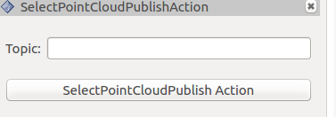

# selected_pointcloud_publish
本工程是从https://github.com/jsk-ros-pkg/jsk_visualization.git 中的jsk_rviz_plugins中的select_point_cloud_publish_action和publish_topic两个插件整合而来.具有把rviz->Select选择的点云发布到特定的topic上.

## 使用
+ 编译好该plugin, 并使得该插件在ROS的路径里.
+ 启动rviz
+ 在rviz菜单Panels->Add New Panel->selected_pointcloud_publish_plugin->SelectPointCloudPublishAction
+ 在Topic上输入输出点云的topic
  用Select选择相应的点云,然后点击SelectPointCloudPublish Action
  